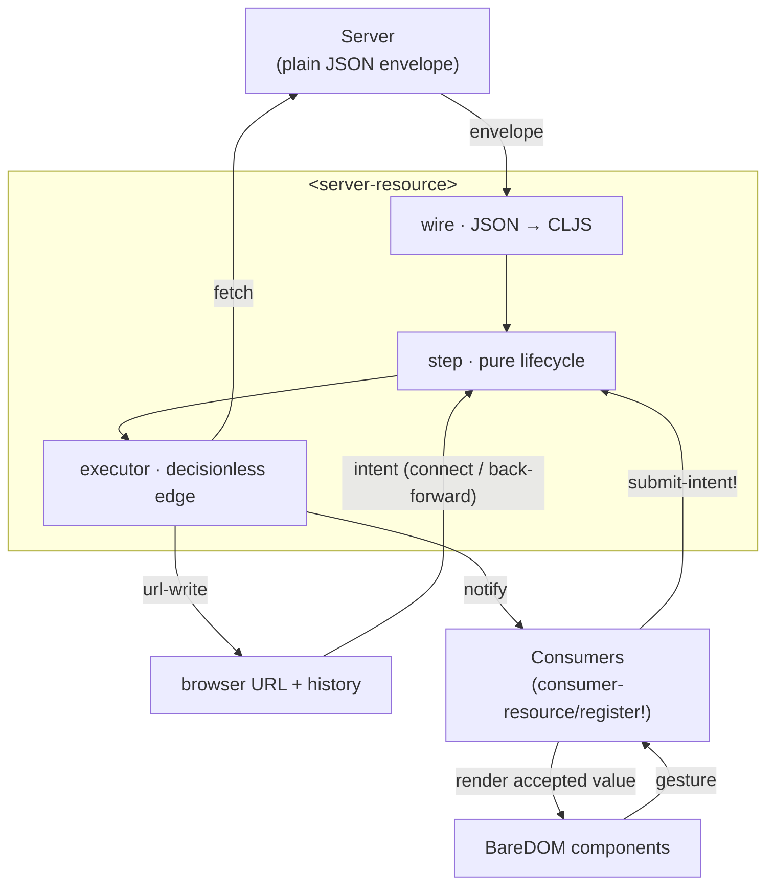
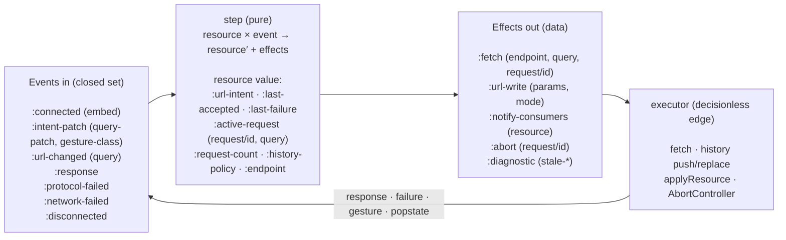

# BareBuild

**A tool that supports presenting data in a Web Component based UI using only server state [BareDOM](https://github.com/avanelsas/baredom).**

BareBuild attempts to support presentational web components using server state only. A client
does not need business logic, store or runtime framework. The two main parts of BareBuild are:

- **`<server-resource>`**: a non-visual custom element that holds one immutable resource
  value, coordinates network delivery, and projects user intent into the URL.
- **`consumer-resource/register!`**: The mechanism that is used to author *consumers*. consumers
are thin elements that translate/project an accepted server value onto a specific web component.

The idea behind BareBuild is that you write a pure projection and a render function. BareBuild owns the whole lifecycle.
A server holds all state and is the only source of truth.

## The loop

Everything is one server-driven cycle:

1. **Get Intent**: A gesture (or the page URL on load) says what the user wants to see.
2. **Fetch from the server**: `<server-resource>` asks the server for exactly that.
3. **The server holds state**: The server answers and its accepted value is the only source of truth.
4. **Render the server state**: The consumer projects that value into a web component.
5. **Repeat**: The next gesture becomes new intent, and the loop turns.

The URL always mirrors the current intent, so every view is a shareable link and the back
button works. State is a succession of immutable values, no atoms, no signals, no
mutable store.

## How it works

At the top level, `<server-resource>` sits between the server and web components.
Plug consumers in with `register!`:



The runtime itself is one pure loop. Events go in, a next value plus effects comes out, and an
executor that performs them:



- **Pure**: Every decision lives in `step` and is visible in the returned effects.
  The executor only performs them (fetch, history, notify, abort). `step` is testable
  and replayable from an event log.
- **One request in flight**: `start-request` mints a monotonic `:request/id`; `pending?`
  and `installable?` derive purely from the value. A response is installed only if its id
  matches the live request. A gesture made mid-flight is picked up by a single trailing
  fetch once the in-flight request clears.
- **Two conversions only**: JSON↔CLJS at the network edge, CLJS→DOM at the component edge.
  CLJS values in between.

> **Integrating a server?** The endpoint must return a specific JSON envelope — see the
> [server contract](./docs/server-contract.md). For the full data flow with a worked consumer
> example, see [`docs/architecture-diagram.md`](./docs/architecture-diagram.md); to write a
> consumer, see [`docs/authoring-a-consumer.md`](./docs/authoring-a-consumer.md).

## Status

**Pre-release, read-only (v1).** Not yet published to npm (`"private": true`). Writes: commands, mutations, optimistic updates — are a separate, later phase.

## Layout

| Path | What |
|---|---|
| `src/barebuild/` | **the product** — the pure core (`resource`, `wire`, `utils`), the `register!` mechanism (`consumer_resource`), and the `<server-resource>` element |
| `demo/` | **the demo** — example consumers, a Babashka dev-server, and a live page (showcase; never shipped) |
| `docs/` | [`server-contract.md`](./docs/server-contract.md), [`architecture-diagram.md`](./docs/architecture-diagram.md), [`authoring-a-consumer.md`](./docs/authoring-a-consumer.md) |
| `test/barebuild/` | product unit tests |

## Develop

```sh
# from this directory:
npm run compile   # compile the ESM lib
npm run build     # release build (Closure Advanced)
npm test          # run the unit tests under Node
```

Lint: `clj-kondo --lint src test`.

BareBuild imports a few BareDOM utilities directly from `../src` (one shared `du`, no fork)
and bundles them into its dist, so the product is self-contained and has no runtime
dependency on BareDOM. (An app whose consumers drive BareDOM components installs
`@vanelsas/baredom` itself — that's the app's dependency, not BareBuild's.)

Running the showcase demo (a live page driving BareDOM components from a tasks server) has
its own guide, see [`demo/README.md`](./demo/README.md).

## License

[MIT](./LICENSE) — same as BareDOM.
