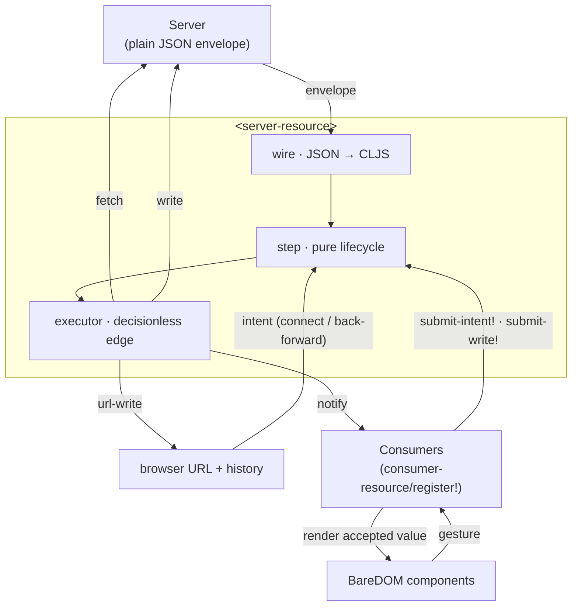
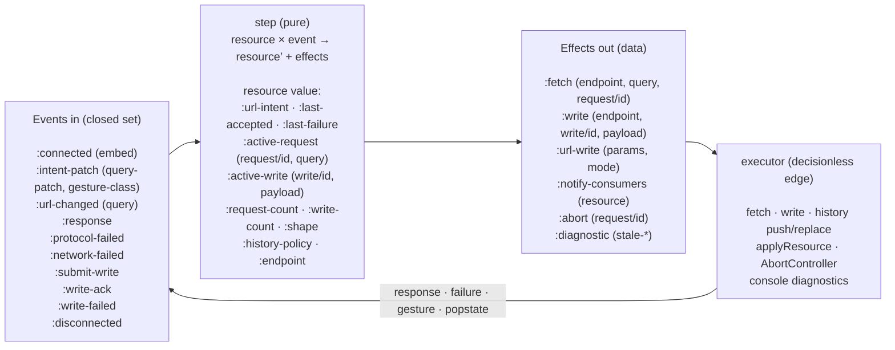

# BareBuild

**A tool that supports presenting data in a Web Component based UI using only server state [BareDOM](https://github.com/avanelsas/baredom).**

BareBuild attempts to support presentational web components using **server state only**. A client
does not need business logic, store or runtime framework. The two main parts of BareBuild are:

- **`<server-resource>`**: a non-visual custom element that holds one immutable resource
  value, coordinates network delivery, and projects user intent into the URL.
- **`consumer-resource/register!`**: The mechanism that is used to author *consumers*. consumers
are thin elements that translate/project an accepted server value onto a specific web component.
- **`submit-intent!` / `submit-write!`**: what a consumer's gesture handlers call to send a
  change of intent (sort, filter, page) or a write (create, delete) back into the loop.

The idea behind BareBuild is that you write a pure projection and a render function. BareBuild owns the whole lifecycle.
A server holds all state and is the only source of truth.

## The loop

Everything is one server-driven cycle:

1. **Get Intent**: A gesture (or the page URL on load) says what the user wants to see, or
   what they want to change.
2. **Ask the server**: `<server-resource>` fetches exactly that, or submits the write.
3. **The server holds state**: The server answers and its accepted value is the only source of truth.
4. **Render the server state**: The consumer projects that value into a web component. A
   successful write refetches, so the result arrives through the same render path.
5. **Repeat**: The next gesture becomes new intent, and the loop turns.

The URL always mirrors the current intent, so every view is a shareable link and the back
button works. State is a succession of immutable values, no atoms, no signals, no
mutable store.

## How it works

At the top level, `<server-resource>` sits between the server and web components.
Plug consumers in with `register!`:



The runtime itself is one pure loop. Events go in, a next value plus effects comes out, and an
executor that performs them:



- **Pure**: Every decision lives in `step` and is visible in the returned effects.
  The executor only performs them (fetch, write, history, notify, abort, diagnostics).
  `step` is testable and replayable from an event log.
- **Writes are the same loop**: a consumer calls `submit-write!`, `step` emits a `:write`
  effect, and the ack comes back as `:write-ack` and triggers a refetch. What is
  rendered always comes from the server, never from a local guess. `writing?` derives from
  the value exactly as `pending?` does. Create payloads are validated first against the
  `:shape` the server sent.
- **One request in flight**: `start-request` mints a monotonic `:request/id`; `pending?`
  and `installable?` derive purely from the value. A response is installed only if its id
  matches the live request. A gesture made mid-flight is picked up by a single trailing
  fetch once the in-flight request clears.
- **Two conversions**: JSON<->CLJS at the network edge, CLJS->DOM at the component edge.
  CLJS values in between.

> **Integrating a server?** The endpoint must return a specific JSON envelope — see the
> [server contract](./docs/server-contract.md). For the full data flow with a worked consumer
> example, see [`docs/architecture-diagram.md`](./docs/architecture-diagram.md); to write a
> consumer, see [`docs/authoring-a-consumer.md`](./docs/authoring-a-consumer.md).

## Status

**0.1.0 — first release.** Reads and writes both work end to end: fetch, sort, filter, page,
URL round-trip, create, delete, shape-driven validation, and keep-last-good on failure.
Writes cover **create and delete only**. There is no update/PUT yet.

BareBuild tries to be component-agnostic by design: a consumer only reads attributes and sets
attributes or properties, so nothing in the runtime knows what it drives. In practice
**14 of BareDOM's 105 components** have been used end to end — `x-stat`, `x-progress`,
`x-table` + `x-table-row` + `x-table-cell`, `x-search-field`, `x-pagination`, `x-alert`,
`x-form`, `x-form-field`, `x-select`, `x-date-picker`, `x-modal`, `x-button`. Components
with imperative-only APIs, canvas rendering, or internal animation state may need consumer
patterns that do not exist yet.

Published to Clojars for ClojureScript host apps.

## Install

```clojure
;; deps.edn
{:deps {com.github.avanelsas/barebuild {:mvn/version "0.1.0"}}}
```

This brings `com.github.avanelsas/baredom` with it, since BareBuild uses a handful of its
utilities. Register the runtime and your own consumers from your app's entry namespace:

```clojure
(ns app.main
  (:require [barebuild.core :as barebuild]
            [barebuild.consumer-resource :as consumer]))

(defn- render-total! [^js x-stat accepted _this]
  (.setAttribute x-stat "value" (str (get-in accepted [:page-info :total-count]))))

(defn init []
  (consumer/register! {:tag       "x-stat-consumer"
                       :child-tag "x-stat"
                       :render    render-total!})
  (barebuild/init))
```

```html
<server-resource src="/api/tasks">
  <x-stat-consumer>
    <x-stat label="Total tasks"></x-stat>
  </x-stat-consumer>
</server-resource>
```

## Layout

| Path | What |
|---|---|
| `src/barebuild/` | **the product** — the pure core (`resource`, `wire`, `utils`), the `register!` mechanism (`consumer_resource`), and the `<server-resource>` element |
| `demo/` | **the demo** — example consumers, a Babashka dev-server, and a live page (showcase; never shipped) |
| `docs/` | [`server-contract.md`](./docs/server-contract.md), [`architecture-diagram.md`](./docs/architecture-diagram.md), [`authoring-a-consumer.md`](./docs/authoring-a-consumer.md) |
| `test/barebuild/` | product unit tests |

## Develop

```sh
# from this directory:
npm run compile   # compile the ESM lib
npm run build     # release build (Closure Advanced)
npm test          # run the unit tests under Node
```

Lint: `clj-kondo --lint src test demo/src demo/test`.

BareBuild imports a few BareDOM utilities (one shared `du`, no fork). The local dev loop
compiles them from the sibling `../src` path; the published jar declares
`com.github.avanelsas/baredom` as a real dependency instead. Keep the two in step. Only
use BareDOM utilities that exist in the version `deps.edn` pins, or a local build will pass
while every consumer's fails. (An app whose consumers drive BareDOM *components* installs
`@vanelsas/baredom` itself. That's the app's dependency, not BareBuild's.)

### Release

Bump the version in `package.json`, `deps.edn` and `build.clj`, add a `CHANGELOG.md` entry,
then tag `barebuild-vX.Y.Z`. The `release-barebuild.yml` workflow refuses to run unless all
three files match the tag, then lints, tests, builds, publishes the jar to Clojars, and
creates the GitHub Release.

Running the showcase demo (a live page driving BareDOM components from a tasks server) has
its own guide, see [`demo/README.md`](./demo/README.md).

## License

[MIT](./LICENSE) — same as BareDOM.
