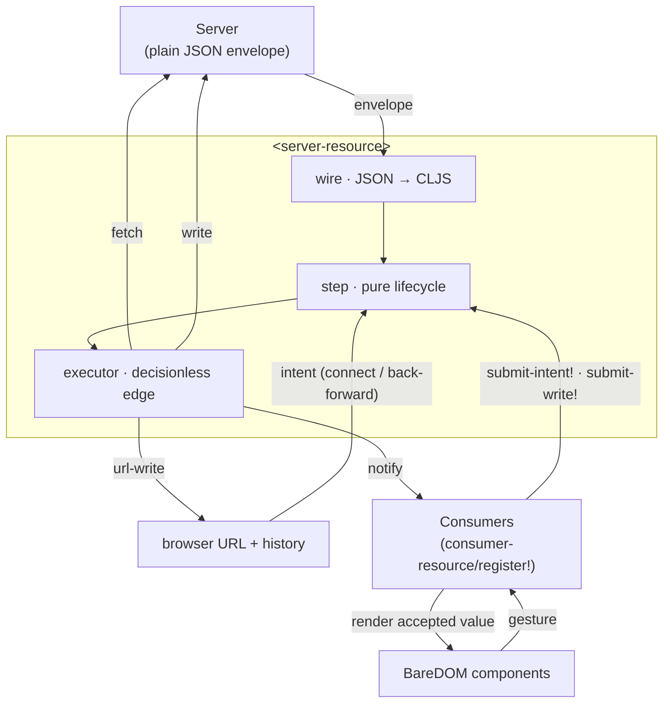
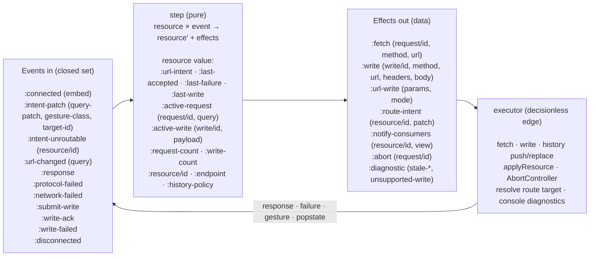

# BareBuild

**Drives a [BareDOM](https://github.com/avanelsas/baredom) Web Component UI from server state alone.**

A BareBuild client carries no business logic, no store and no runtime framework. You write a pure
projection and a render function, and BareBuild owns the rest of the lifecycle. That keeps the client
thin and the UI replayable. It has three parts:

- **`<server-resource>`**: a non-visual custom element that holds one immutable resource
  value, coordinates network delivery, and projects user intent into the URL.
- **`consumer-resource/register!`**: the mechanism that authors a *consumer*, a thin element
  that projects an accepted server value onto a specific web component.
- **`submit-intent!` / `submit-write!`**: what a consumer's gesture handlers call to send a
  change of intent (e.g. sort, filter, page) or a write (create, update, delete, move) back into
  the loop.

The server holds all state and is the only source of truth.

## Disclaimer

- The code for BareBuild has been written by me.
- I used Claude as a brainstorming tool to sharpen my thoughts and ideas.
- I used Claude to write tests, review the code, and help write some of the docs

## The loop

Everything is one server-driven cycle:

1. **Get Intent**: A gesture (or the page URL on load) says what the user wants to see, or
   what they want to change.
2. **Ask the server**: `<server-resource>` fetches exactly that, or submits the write.
3. **The server holds state**: The server answers and its accepted value is the only source of truth.
4. **Render the server state**: The consumer projects that value into a web component. A
   write is answered with the new state, so its result arrives through the same render path.
5. **Repeat**: The next gesture becomes new intent, and the loop turns.

The URL always mirrors the current intent, so every view is a shareable link and the back
button works. State is a succession of immutable values, no atoms, no signals, no
mutable store.

## How it works

At the top level, `<server-resource>` sits between the server and web components.
Plug consumers in with `register!`:


```mermaid
%%{init: {'themeVariables': {'fontSize': '18px'}}}%%
flowchart TB
  SERVER["Server<br/>(plain JSON envelope)"]
  subgraph SR["&lt;server-resource&gt;"]
    direction TB
    WIRE["wire · JSON → CLJS"]
    STEP["step · pure lifecycle"]
    EXEC["executor · decisionless edge"]
  end
  URL["browser URL + history"]
  CONS["Consumers<br/>(consumer-resource/register!)"]
  COMP["BareDOM components"]

  SERVER -->|"envelope"| WIRE
  WIRE --> STEP
  STEP --> EXEC
  EXEC -->|"fetch"| SERVER
  EXEC -->|"url-write"| URL
  URL -->|"intent (connect / back-forward)"| STEP
  EXEC -->|"write"| SERVER
  EXEC -->|"notify"| CONS
  CONS -->|"render accepted value"| COMP
  COMP -->|"gesture"| CONS
  CONS -->|"submit-intent! · submit-write!"| STEP
```

The runtime itself is one pure loop. Events go in, a next value plus effects comes out, and an
executor that performs them:


```mermaid
%%{init: {'themeVariables': {'fontSize': '18px'}}}%%
flowchart LR
  EVENTS["Events in (closed set)<br/><br/>:connected (embed)<br/>:intent-patch (query-patch, gesture-class, target-id)<br/>:intent-unroutable (resource/id)<br/>:url-changed (query)<br/>:response<br/>:protocol-failed<br/>:network-failed<br/>:submit-write<br/>:write-ack<br/>:write-failed<br/>:disconnected"]

  STEP["step (pure)<br/>resource × event → resource′ + effects<br/><br/>resource value:<br/>:url-intent · :last-accepted · :last-failure · :last-write<br/>:active-request (request/id, query)<br/>:active-write (write/id, payload)<br/>:request-count · :write-count<br/>:resource/id · :endpoint · :history-policy"]

  EFFECTS["Effects out (data)<br/><br/>:fetch (request/id, method, url)<br/>:write (write/id, method, url, headers, body)<br/>:url-write (params, mode)<br/>:route-intent (resource/id, patch)<br/>:notify-consumers (resource/id, view)<br/>:abort (request/id)<br/>:diagnostic (stale-*, unsupported-write)"]

  EXEC["executor (decisionless edge)<br/><br/>fetch · write · history push/replace<br/>applyResource · AbortController<br/>resolve route target · console diagnostics"]

  EVENTS --> STEP --> EFFECTS --> EXEC
  EXEC -->|"response · failure · gesture · popstate"| EVENTS
```

- **Pure**: Every decision lives in `step` and is visible in the returned effects.
  The executor only performs them (fetch, write, history, notify, abort, diagnostics). Its one
  deliberate exception is the optional [request decorator](./docs/request-configuration.md),
  a host-app hook for credentials that change on their own schedule rather than with the value.
  `step` is testable and replayable from an event log (see [BareReplay](https://github.com/avanelsas/baredom/barereplay)).
- **Writes are the same loop**: a consumer calls `submit-write!`, `step` emits a `:write`
  effect, and the ack comes back as `:write-ack`. An accepted ack carries the server's new
  state and installs exactly as a read's response does. What is rendered always comes from
  the server, never from a local guess. `writing?` derives from the value exactly as
  `pending?` does. The op, create, update, delete or move, is a row in a table that `step`
  resolves into a method, a URL and an optional body, so the edge performs the request and
  decides nothing about it.
- **One request in flight**: `start-request` mints a monotonic `:request/id`. `pending?`
  and `installable?` derive purely from the value. A response is installed only if its id
  matches the live request. A gesture made mid-flight is picked up by a single trailing
  fetch once the in-flight request clears.
- **Two conversions**: JSON<->CLJS on the way in (a response, an SSR boot embed, a config
  attribute), CLJS->DOM at the component edge. CLJS values in between.

> **Integrating a server?** The endpoint must return a specific JSON envelope. See the
> [server contract](./docs/server-contract.md). For the full data flow with a worked consumer
> example, see [`docs/architecture-diagram.md`](./docs/architecture-diagram.md). To write a
> consumer, see [`docs/authoring-a-consumer.md`](./docs/authoring-a-consumer.md). To send
> cookies or static headers with every request, see
> [`docs/request-configuration.md`](./docs/request-configuration.md).

## Coordinating multiple resources

One page can hold several `<server-resource>` elements, each owning a slice of the URL. A named
resource writes its intent under its **`resource-id`**, so give each one an id and their query
keys never collide: `projects.*` for one, `tasks.*` for another. A single unnamed resource keeps
the bare root keys (`?sort=…`), so name a resource only when it shares a page or is a target.
Every view is still a single shareable link, and the back button still works.

Naming also isolates a resource's requests: a named resource reads and sends only its own
`<id>.`-prefixed keys, so unrelated or tracking params on the URL (`utm_source`, `fbclid`) never
reach its API. The unnamed root owns every bare key and forwards them all, so prefer a named
resource on any page that also carries params it does not own.

Consumers coordinate by **naming a sibling**. A gesture handler calls `submit-intent!` with a
target id, which drives that sibling's URL projection and refetch. There is no shared store and
no direct element reference, only the URL.

Coordination is **write-only**: a consumer can drive a named sibling but cannot read one. Its
view carries its own resource's state and nothing else. Model so that a resource owns the state
it displays, and see
[the view is per resource](./docs/authoring-a-consumer.md#the-view-is-per-resource) for what to
do when you cannot.

```clojure
;; selecting a project drives the tasks resource, not this one
(consumer-resource/submit-intent!
  el {:query-patch {:project id} :gesture-class :navigation} "tasks")
```

```html
<server-resource resource-id="projects" src="/api/projects">
  <x-project-selector-consumer>
    <x-select label="Project"></x-select>
  </x-project-selector-consumer>
</server-resource>

<server-resource resource-id="tasks" src="/api/tasks">
  <x-board-consumer><!-- three drop-zones of draggable cards --></x-board-consumer>
</server-resource>
```

Picking a project writes `tasks.project` into the URL, the tasks resource refetches its filtered
set, and the board repaints. The demo's kanban board is built entirely this way. The step
function is unchanged: coordination is just two resources each running the same pure loop, joined
through the one place they already share, the URL.

## Status

**Reads and writes both work end to end**: fetch, sort, filter, page, URL round-trip, create,
update, delete, move, shape-driven validation, and keep-last-good on failure. Update is a **full
replace** (PUT). Move is a **positional command** (PATCH) that repositions a member by its
server-owned rank, carrying only the destination. There is no optimistic rendering. Nothing
appears on screen until the server has performed the write and answered with the new state.

BareBuild is component-agnostic. A consumer only reads attributes and sets attributes or
properties, so nothing in the runtime knows what it drives. So far **17 of BareDOM's 106
components** have been driven end to end: `x-stat`, `x-progress`, `x-spinner`,
`x-table` + `x-table-row` + `x-table-cell`, `x-search-field`, `x-pagination`, `x-alert`,
`x-form`, `x-form-field`, `x-select`, `x-date-picker`, `x-modal`, `x-button`, `x-drag-panel`,
`x-drop-zone`. Components with imperative-only APIs, canvas rendering, or internal animation
state may need consumer patterns that do not exist yet.

Published to Clojars.

## Debugging

[BareReplay](../barereplay/README.md) is a companion time-travel debugger for
BareBuild apps. It records the event log and reconstructs any past state by
replaying the pure `step`, then re-projects it onto the live components. Add it in
one call and scrub, step, and jump through and replay everything the app has done, with the
request and response behind each step. See the BareBuild demo to see BareReplay in
action.

## Install

```clojure
;; deps.edn
{:deps {com.github.avanelsas/barebuild {:mvn/version "0.6.0"}}}
```

This brings `com.github.avanelsas/baredom` with it, since BareBuild uses a handful of its
utilities. Register the runtime and your own consumers from your app's entry namespace:

```clojure
(ns app.main
  (:require [barebuild.core :as barebuild]
            [barebuild.consumer-resource :as consumer]))

;; Every hook is handed (child view this). The view carries :accepted, :failure, :intent,
;; :pending?, :writing? and :write.
(defn- render-total! [^js x-stat {:keys [accepted]} _this]
  (.setAttribute x-stat "value" (str (get-in accepted [:page-info :total-count]))))

(defn init []
  (consumer/register! {:tag       "x-stat-consumer"
                       :child-tag "x-stat"
                       :render    render-total!})
  (barebuild/init))
```

```html
<server-resource src="/api/tasks">
  <x-stat-consumer>
    <x-stat label="Total tasks"></x-stat>
  </x-stat-consumer>
</server-resource>
```

## Layout

| Path | What |
|---|---|
| `src/barebuild/` | **the product**. The pure core (`resource`, `wire`, `utils`), the `register!` mechanism (`consumer_resource`), and the `<server-resource>` element |
| `demo/` | **the demo**. Example consumers, a Babashka dev-server, and a live page (showcase, not shipped) |
| `docs/` | [`server-contract.md`](./docs/server-contract.md), [`architecture-diagram.md`](./docs/architecture-diagram.md), [`authoring-a-consumer.md`](./docs/authoring-a-consumer.md), [`request-configuration.md`](./docs/request-configuration.md) |
| `test/barebuild/` | product unit tests |

## Develop

```sh
# from this directory:
npm run compile   # compile the ESM lib
npm run build     # release build (Closure Advanced)
npm test          # run the unit tests under Node
```

Lint: `clj-kondo --lint src test demo/src demo/test`.

BareBuild imports a few BareDOM utilities (one shared `du`, no fork). The local dev loop
compiles them from the sibling `../src` path. The published jar declares
`com.github.avanelsas/baredom` as a real dependency instead. Keep the two in step. Only
use BareDOM utilities that exist in the version `deps.edn` pins, or a local build will pass
while every consumer's fails. (An app whose consumers drive BareDOM *components* installs
`@vanelsas/baredom` itself. That's the app's dependency, not BareBuild's.)

### Release

Bump the version in `package.json`, `deps.edn` and `build.clj`, add a `CHANGELOG.md` entry,
then tag `barebuild-vX.Y.Z`. The `release-barebuild.yml` workflow refuses to run unless all
three files match the tag, then lints, tests, builds, publishes the jar to Clojars, and
creates the GitHub Release.

Running the showcase demo (a live page driving BareDOM components from a tasks server) has
its own guide, see [`demo/README.md`](./demo/README.md).

## License

[MIT](./LICENSE), same as BareDOM.
