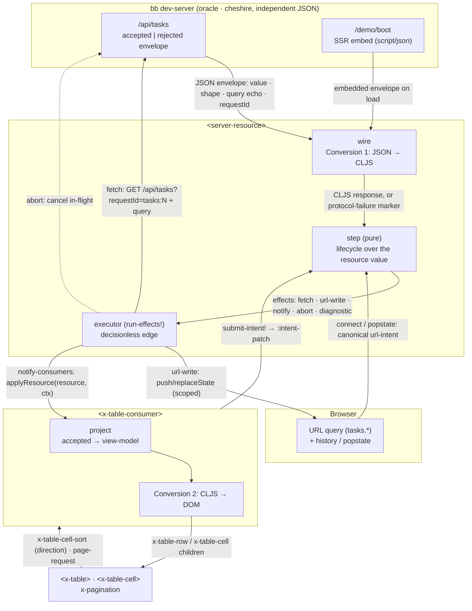
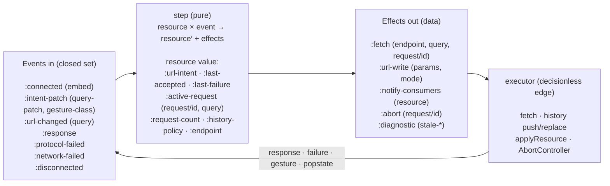
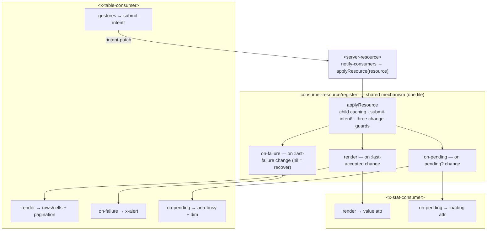

# BareBuild — Architecture Diagram

A read-only projection of server state into presentational BareDOM components. Two
custom elements (`<server-resource>`, `<x-table-consumer>`) sit between an independent
JSON server and the visual `<x-table>`; the whole lifecycle is one pure `step` function
whose only outputs are a next value and a list of effects executed at a decisionless edge.

Two figures: **Figure 1** is the whole picture (boxes = structure, arrows = data flow);
**Figure 2** zooms into the pure `step` ↔ effects ↔ executor loop.

## Figure 1 — Overview (structure + data flow)

**Arrow legend (the data that rides each edge):**

- **URL → step** — on connect and on back/forward, `construct-url-intent` reads the
  `tasks.*` params and `canonicalize-query`s them into the `:url-intent`.
- **executor → server** — a `:fetch` effect becomes `GET /api/tasks?requestId=…&<query>`.
  The request id is minted *inside* `step` and carried on the effect.
- **server → wire** — a plain JSON envelope (accepted: `outcome/requestId/revision/query/
  value/shape/pageInfo`; rejected: `outcome/requestId/query/error`). The server emits it
  independently (cheshire), never via BareBuild's bijection.
- **wire → step** — Conversion 1 parses it to a CLJS `:response` value, or a
  `:protocol-failed` marker for a malformed envelope.
- **step → executor** — the pure result: a next resource value plus effects as data.
- **executor → URL** — a `:url-write` reflects the (adopted, normalized) query back into
  the address bar via `build-scoped-url` + `history`.
- **executor → consumer** — a `:notify-consumers` calls `applyResource`, handing over the
  whole resource value.
- **consumer → x-table** — `project` builds a `{:columns :rows}` view-model; Conversion 2
  renders it as `x-table-row`/`x-table-cell` children.
- **x-table → consumer → step** — a sort/page gesture becomes an intent patch via
  `translate-gesture` and re-enters `step` as `:intent-patch`.

## Figure 2 — Zoom: the pure loop (`step` ↔ effects ↔ executor)

**What the loop guarantees:**

- **Pure vs edge.** Every decision lives in `step` and is visible in the returned
  effects; the executor only performs them (fetch, history, notify, abort). `step` is
  `=`-testable and replayable from an event log.
- **One request in flight.** `start-request` mints a monotonic `:request/id` into
  `:active-request`; `pending?`/`installable?` derive purely from the value. A response is
  installed iff its id matches the live request; a gesture made mid-flight is picked up by
  the single trailing fetch once the in-flight request clears.
- **Two conversions only.** JSON↔CLJS at the network edge (`wire`, Figure 1 left) and
  CLJS→DOM at the component edge (`x-table-consumer`, Figure 1 right). CLJS values in
  between, because structural `=` is load-bearing.

## Figure 3 — The consumer layer (one mechanism, many thin consumers)

**The de-complect.** Every consumer braids three concerns; the mechanism owns one and each
consumer owns the other two:

- **Mechanism** (`consumer_resource.cljs`) — *how a consumer is driven*: the `applyResource`
  install, the three change-guards, child caching, intent submission. Written once.
- **Calculation** (each `model.cljs`) — *resource → view data*: pure, node-tested projection.
- **Effect** (each element file) — *view data → DOM*: the `render`/`on-failure`/`on-pending`
  hooks, all `(child value this)`.

Adding a component is therefore a projection plus a render fn (plus optional hooks) — the
mechanism is untouched. x-stat (scalar, display-only) and x-table (list, gestures, failure
UI, pagination) are the two ends of that range, driven by the same core.
