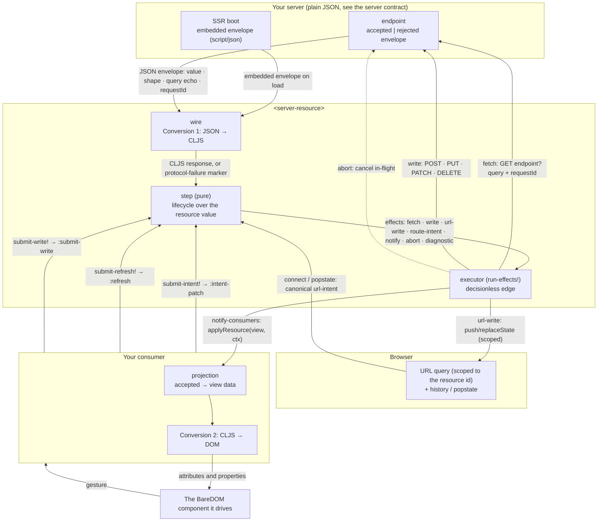
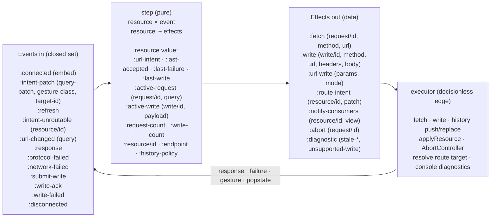
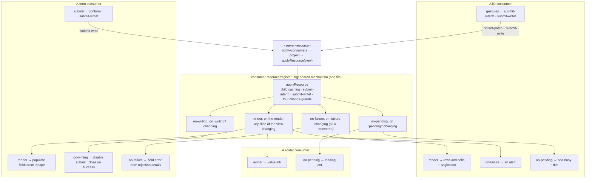

# BareBuild architecture

A projection of server state into presentational BareDOM components, with writes running back
through the same loop. One shipped element, `<server-resource>`, sits between a JSON server and
the consumers you write. The whole lifecycle is one pure `step` function whose only outputs are
a next value and a list of effects, performed at a decisionless edge.

Three figures. **Figure 1** is the whole picture, boxes for structure and arrows for data flow.
**Figure 2** zooms into the pure loop. **Figure 3** is the consumer layer.

## Figure 1. Overview

```mermaid
%%{init: {'themeVariables': {'fontSize': '18px'}}}%%
flowchart TB
  subgraph SERVER["Your server (plain JSON, see the server contract)"]
    API["endpoint<br/>accepted | rejected envelope"]
    BOOT["SSR boot<br/>embedded envelope (script/json)"]
  end

  subgraph BROWSER["Browser"]
    URL["URL query (scoped to the resource id)<br/>+ history / popstate"]
  end

  subgraph SR["&lt;server-resource&gt;"]
    WIRE["wire<br/>Conversion 1: JSON → CLJS"]
    STEP["step (pure)<br/>lifecycle over the resource value"]
    EXEC["executor (run-effects!)<br/>decisionless edge"]
  end

  subgraph CONS["Your consumer"]
    PROJ["projection<br/>accepted → view data"]
    C2["Conversion 2: CLJS → DOM"]
  end

  COMP["The BareDOM component it drives"]

  URL -->|"connect / popstate: canonical url-intent"| STEP
  BOOT -->|"embedded envelope on load"| WIRE
  EXEC -->|"fetch: GET endpoint?query + requestId"| API
  EXEC -->|"write: POST · PUT · PATCH · DELETE"| API
  EXEC -.->|"abort: cancel in-flight"| API
  API -->|"JSON envelope: value · shape · query echo · requestId"| WIRE
  WIRE -->|"CLJS response, or protocol-failure marker"| STEP
  STEP -->|"effects: fetch · write · url-write · route-intent · notify · abort · diagnostic"| EXEC
  EXEC -->|"url-write: push/replaceState (scoped)"| URL
  EXEC -->|"notify-consumers: applyResource(view, ctx)"| PROJ
  PROJ --> C2
  C2 -->|"attributes and properties"| COMP
  COMP -->|"gesture"| CONS
  CONS -->|"submit-intent! → :intent-patch"| STEP
  CONS -->|"submit-refresh! → :refresh"| STEP
  CONS -->|"submit-write! → :submit-write"| STEP
```

**Arrow legend, the data that rides each edge:**

- **URL to step.** On connect and on back or forward, the element reads the params its resource
  id owns and `canonicalize-query`s them into the `:url-intent`.
- **executor to server.** A `:fetch` effect becomes `GET endpoint?requestId=…&<query>`. The
  request id is minted *inside* `step` and carried on the effect. A `:write` effect becomes the
  method its op declares, with the record as its body when the op carries one, and its write id
  is minted the same way.
- **server to wire.** A plain JSON envelope. Accepted carries
  `outcome/requestId/revision/query/value/shape/pageInfo`, rejected carries `error` instead of
  `value` and `shape`. A write is answered with the same envelope.
- **wire to step.** Conversion 1 parses it into a CLJS `:response` value, or into a
  `:protocol-failed` marker for a malformed envelope.
- **step to executor.** The pure result. A next resource value plus effects as data.
- **executor to URL.** A `:url-write` reflects the adopted, normalized query back into the
  address bar with `build-scoped-url` and `history`.
- **executor to consumer.** A `:notify-consumers` projects the resource into a view
  (`:accepted :failure :intent :pending? :writing? :write`) and calls `applyResource` with it.
  The runtime's own bookkeeping never crosses this edge.
- **consumer to component.** Your projection builds whatever the component wants, and
  Conversion 2 assigns it as attributes or properties.
- **component to step.** A gesture becomes an intent patch and re-enters as `:intent-patch`, a
  bare ask-again that re-enters as `:refresh`, or a write payload that re-enters as
  `:submit-write`. `:refresh` is the one read a gesture can open without claiming the query
  moved, so the URL is left alone.

The demo's table page is this diagram with `/api/tasks` and `x-table-consumer` filled in.

## Figure 2. The pure loop

```mermaid
%%{init: {'themeVariables': {'fontSize': '18px'}}}%%
flowchart LR
  EVENTS["Events in (closed set)<br/><br/>:connected (embed)<br/>:intent-patch (query-patch, gesture-class, target-id)<br/>:refresh<br/>:intent-unroutable (resource/id)<br/>:url-changed (query)<br/>:response<br/>:protocol-failed<br/>:network-failed<br/>:submit-write<br/>:write-ack<br/>:write-failed<br/>:disconnected"]

  STEP["step (pure)<br/>resource × event → resource′ + effects<br/><br/>resource value:<br/>:url-intent · :last-accepted · :last-failure · :last-write<br/>:active-request (request/id, query)<br/>:active-write (write/id, payload)<br/>:request-count · :write-count<br/>:resource/id · :endpoint · :history-policy"]

  EFFECTS["Effects out (data)<br/><br/>:fetch (request/id, method, url)<br/>:write (write/id, method, url, headers, body)<br/>:url-write (params, mode)<br/>:route-intent (resource/id, patch)<br/>:notify-consumers (resource/id, view)<br/>:abort (request/id)<br/>:diagnostic (stale-*, unsupported-write)"]

  EXEC["executor (decisionless edge)<br/><br/>fetch · write · history push/replace<br/>applyResource · AbortController<br/>resolve route target · console diagnostics"]

  EVENTS --> STEP --> EFFECTS --> EXEC
  EXEC -->|"response · failure · gesture · popstate"| EVENTS
```

**What the loop guarantees:**

- **Pure versus edge.** Every decision lives in `step` and is visible in the returned effects.
  The executor only performs them: fetch, write, history, notify, abort, diagnostics. `step` is
  `=`-testable and replayable from an event log.
- **Writes re-enter the same loop.** `submit-write!` becomes `:submit-write`, which becomes a
  `:write` effect. The ack returns as `:write-ack`, and an accepted one carries the server's
  full post-mutation state, which installs exactly as a read's response does. `writing?` derives
  from `:active-write` exactly as `pending?` derives from `:active-request`, and a stale ack is
  dropped by the same id-match rule. Nothing is rendered optimistically, so no rollback path
  exists to get wrong.
- **One request in flight.** `start` mints a monotonic `:request/id` into `:active-request`, and
  `pending?` and `installable?` derive purely from the value. A response is installed only if
  its id matches the live request. A gesture made mid-flight is picked up by the single trailing
  fetch once the in-flight request clears.
- **Two conversions only.** JSON to CLJS at the network edge (`wire`, Figure 1 left) and CLJS to
  DOM at the component edge (the consumer, Figure 1 right). CLJS values in between, because
  structural `=` is load-bearing.

## Figure 3. The consumer layer

```mermaid
%%{init: {'themeVariables': {'fontSize': '18px'}}}%%
flowchart TB
  SR["&lt;server-resource&gt;<br/>notify-consumers → project → applyResource(view)"]

  subgraph MECH["consumer-resource/register!, the shared mechanism (one file)"]
    APPLY["applyResource<br/>child caching · submit-intent! · submit-write! · four change-guards"]
    G1["render, on the render-key slice of the view changing"]
    G2["on-failure, on :failure changing (nil = recovered)"]
    G3["on-pending, on :pending? changing"]
    G4["on-writing, on :writing? changing"]
    APPLY --> G1
    APPLY --> G2
    APPLY --> G3
    APPLY --> G4
  end

  subgraph LIST["A list consumer"]
    TR["render → rows and cells + pagination"]
    TF["on-failure → an alert"]
    TP["on-pending → aria-busy + dim"]
    TG["gestures → submit-intent! · submit-write!"]
  end

  subgraph FORM["A form consumer"]
    FR["render → populate fields from :shape"]
    FW["on-writing → disable submit · close on success"]
    FF["on-failure → field error from rejection details"]
    FG["submit → conform · submit-write!"]
  end

  subgraph STAT["A scalar consumer"]
    ST["render → value attr"]
    SP["on-pending → loading attr"]
  end

  SR --> APPLY
  G1 --> TR
  G2 --> TF
  G3 --> TP
  G1 --> ST
  G3 --> SP
  G1 --> FR
  G2 --> FF
  G4 --> FW
  TG -->|":intent-patch · :submit-write"| SR
  FG -->|":submit-write"| SR
```

**The de-complect.** Every consumer braids three concerns. The mechanism owns one and each
consumer owns the other two:

- **Mechanism** (`consumer_resource.cljs`), *how a consumer is driven*: the `applyResource`
  install, the four change-guards, child caching, intent and write submission. Written once.
- **Calculation** (each `model.cljs`), *resource to view data*: a pure, node-tested projection.
- **Effect** (each element file), *view data to DOM*: the `render`, `on-failure`, `on-pending`
  and `on-writing` hooks, all `(child view this)`, each handed the whole view and told apart
  only by the slice whose movement fires it.

Adding a component is therefore a projection plus a render fn, plus optional hooks. The
mechanism is untouched. A scalar, a list with gestures and failure UI, and a form with writes
and validation span that range, driven by the same core. To write one, see
[authoring a consumer](./authoring-a-consumer.md).
