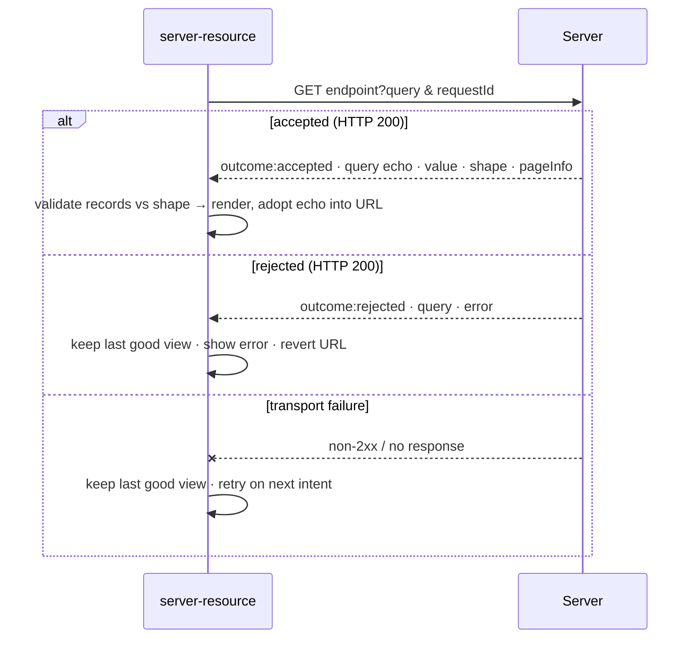
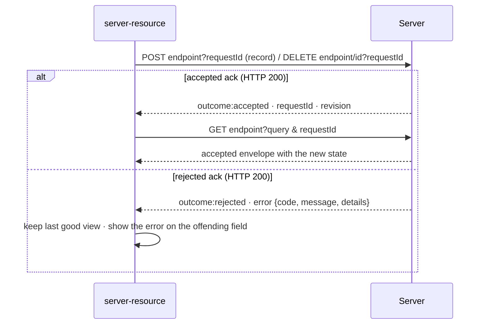

# The server contract

BareBuild never owns state: it renders whatever an HTTP endpoint returns, and sends writes
back to that same endpoint. That endpoint is the real integration point, the contract a
server must satisfy. It is transport- and language-agnostic (plain JSON). The demo's
[`demo/dev-server/server.clj`](../demo/dev-server/server.clj) is a complete
reference implementation.

## The read request

BareBuild fetches with a single GET, no body:

```
GET <endpoint>?<query>&requestId=<id>
```

- **`<endpoint>`**: The `src` of the `<server-resource>`.
- **`<query>`**: The current user intent as URL query params (sort, page, filter, …
  whatever the consumers submit). BareBuild forwards them as-is. The server decides which it
  honors.
- **`requestId`**: An opaque id BareBuild mints per request, echo it back unchanged.

## The write requests

Two mutations, both carrying a `requestId` the same way. There is **no update/PUT** yet.

```
POST   <endpoint>?requestId=<id>          body: the record as JSON
DELETE <endpoint>/<id>?requestId=<id>     no body
```

- **Create** posts a flat JSON object keyed by the shape's field keys. The server mints the
  identity. The client never sends one.
- **Delete** puts the record's id in the path, taken from the `idKey` field of the row.

A write's response is an **ack**, not data (see [Write acks](#write-acks)). After an accepted
ack BareBuild refetches, so new state is always observed through the read path rather than
inferred from the ack. There is no optimistic update: nothing appears on screen until the
server has confirmed it and the refetch has landed.

## The read response

Always **HTTP 200** for a business outcome (see [Status codes](#status-codes)). The JSON body
is one of two envelopes.

### Accepted — the server returns data

| Field | Type | Notes |
|---|---|---|
| `outcome` | `"accepted"` | |
| `requestId` | string | echo of the request's id |
| `revision` | string | opaque version tag for the resource |
| `query` | object | the server's **normalized** echo of the honored query (see [The query echo](#the-query-echo-is-load-bearing)) |
| `value` | array | the records to render |
| `shape` | object | structural contract for the records (see [The shape](#the-shape)) |
| `pageInfo` | object | `{ page, pageSize, totalPages, totalCount }` — all numbers |

### Rejected — the server refuses the query

A *business* verdict (e.g. an unsupported sort field), not a transport error.

| Field | Type | Notes |
|---|---|---|
| `outcome` | `"rejected"` | |
| `requestId` | string | echo |
| `revision` | string | |
| `query` | object | the rejected query, echoed |
| `error` | object | `{ code, message, details }` — `code` a short slug, `message` human-readable, `details` free-form |

A rejected envelope carries **no `value` / `shape`**. BareBuild keeps the last good view and
surfaces the error.

## Write acks

A create or delete answers with an **ack**: the verdict on the mutation, never the new data.
Also always HTTP 200.

### Accepted — the server performed the write

| Field | Type | Notes |
|---|---|---|
| `outcome` | `"accepted"` | |
| `requestId` | string | echo of the write's id |
| `revision` | string | opaque version tag |

No `value`, no `shape`, no `query`. BareBuild refetches to observe the result.

### Rejected — the server refuses the write

| Field | Type | Notes |
|---|---|---|
| `outcome` | `"rejected"` | |
| `requestId` | string | echo |
| `revision` | string | |
| `error` | object | `{ code, message, details }` |

For a rejected write, put the offending field name in `details` (e.g.
`{"field": "end"}`). A consumer maps that back onto the form input, which is why a
field-level rejection can be shown in place instead of as a banner.

Business rules the client cannot know : "end date must not precede start date", uniqueness,
authorization, belong here as a rejected ack. The client's local validation
(see [The shape](#the-shape)) is only a faster UX. The server is the authority.

## The shape

`shape` is a structural description of a record: which field is its identity, and the key and
type of every field it carries. BareBuild validates each response against it, so the runtime
stays domain-agnostic. It never hardcodes field names. The shape tells it what to expect.

```json
{
  "idKey": "id",
  "fields": [
    { "key": "title",  "type": "string", "required": true },
    { "key": "owner",  "type": "string", "required": true },
    { "key": "start",  "type": "date",   "required": true },
    { "key": "end",    "type": "date" },
    { "key": "status", "type": "string", "required": true, "enum": ["todo", "doing", "done"] }
  ]
}
```

- **`idKey`**: The field that uniquely identifies a record. Every record must have it, and ids must
  be unique.
- **`fields`**: The declared, consumable fields. Each has a `key` and a `type`, one of
  **`string` · `number` · `date` · `url`**. `null` is allowed for any field.
- **`required`** *(optional, boolean)*: the field must be present and non-blank in a create
  payload.
- **`enum`** *(optional, array)*: the only permitted values for the field.

`required` and `enum` drive **writes**, not reads: a consumer can build a create form from
the shape and check the payload before submitting. They are advisory to the client and
binding on the server, a create that slips past the local check must still be rejected
server-side.

On every accepted response BareBuild **validates the records against this shape** (id present and
unique, each declared field present, each value the declared type). A mismatch is a *contract
failure*: the response is not installed and the last good view stays.

## Two rules to keep in mind

### Status codes

`accepted` and `rejected` are **both HTTP 200**. The `outcome` field carries the verdict, not
the status code. A `4xx` / `5xx` is read as a **transport failure**, not a rejection. So don't
return `400` for an invalid query, return `200` with `outcome: "rejected"`.

### The query echo is load-bearing

The server must **echo the query it honored**, normalized, in the accepted `query`
field. BareBuild adopts that echo as the canonical intent and writes it back to the URL. If you
drop a param you honored from the echo, BareBuild reads it as *"the server removed that param"*
and strips it from the URL. The classic symptom is a filter or sort that silently reverts.
Echo every param you honored. Omit only the ones you genuinely ignored.

## Failure modes

BareBuild distinguishes four, and **all keep the last good view on screen**:

| Failure | Trigger |
|---|---|
| **rejected** | `outcome: "rejected"` with an `error` — on a read or on a write ack |
| **contract** | an accepted envelope whose records don't match the declared `shape` |
| **protocol** | the body isn't a valid envelope (unparseable JSON, or missing `value` + `shape` / missing `error`; for an ack, a missing `requestId` or `revision`) |
| **network** | no response, or a non-2xx status |

A failed write leaves the resource untouched: nothing was rendered optimistically, so there
is nothing to roll back.

## The round-trip



And a write, which always ends in a read:



## Optional: SSR boot

To paint on first load with no request, embed the first accepted envelope in the page as a
`<script type="application/json">` child of `<server-resource>`. BareBuild reads it, renders
immediately, and fetches only if the URL intent differs. The demo serves this at `/demo/boot`.

## Reference implementation

The demo's Babashka server ([`demo/dev-server/server.clj`](../demo/dev-server/server.clj))
implements this contract end to end, query normalization, the shape, `pageInfo`, and a
fixture for every failure mode while emitting JSON independently of BareBuild. See
[`../demo/README.md`](../demo/README.md).
