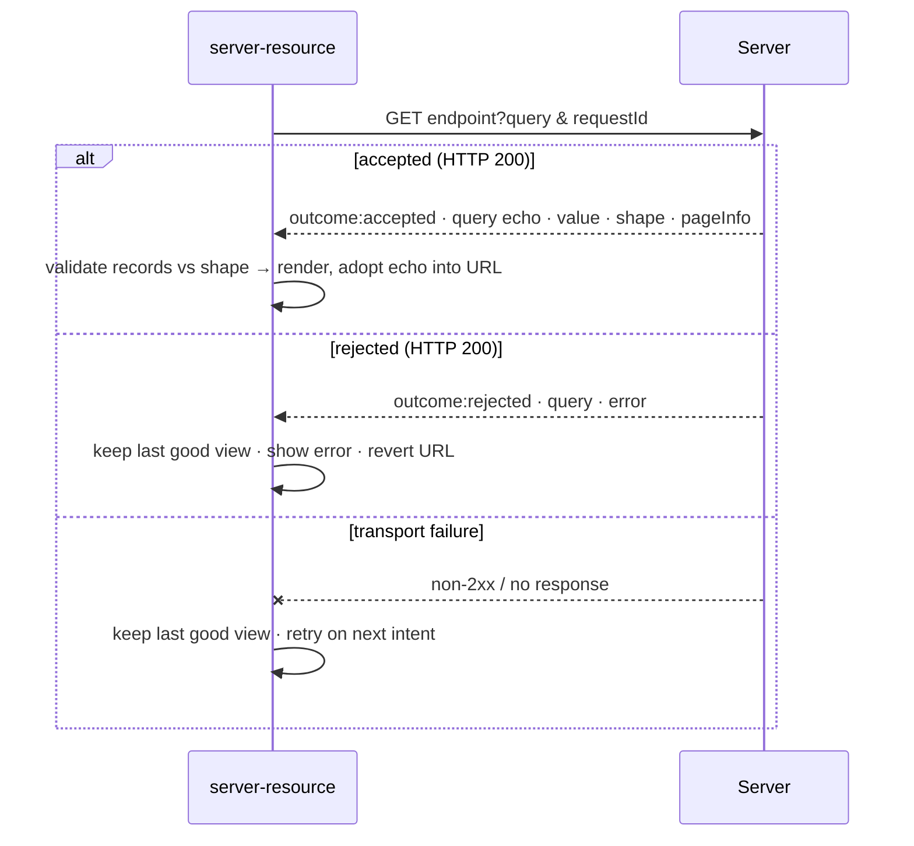
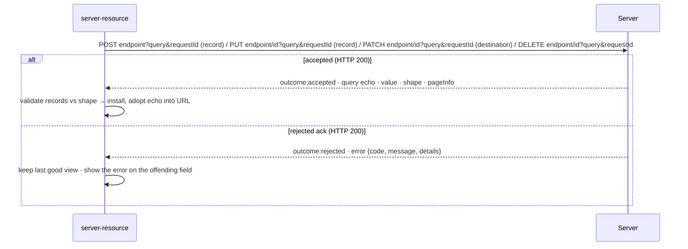

# The server contract

BareBuild never owns state: it renders whatever an HTTP endpoint returns, and sends writes
back to that same endpoint. That endpoint is the real integration point, the contract a
server must satisfy. It is transport- and language-agnostic (plain JSON). The demo's
[`demo/dev-server/server.clj`](../demo/dev-server/server.clj) is a complete
reference implementation.

## The read request

BareBuild fetches with a single GET, no body:

```
GET <endpoint>?<query>&requestId=<id>
```

- **`<endpoint>`**: The `src` of the `<server-resource>`.
- **`<query>`**: The current user intent as URL query params (sort, page, filter, etc.
  whatever the consumers submit). BareBuild forwards them as is. The server decides which it
  honors.
- **`requestId`**: An opaque id BareBuild mints per request, echo it back unchanged.

## The write requests

Four mutations, all carrying a `requestId` and the **current view's query** the same way.

```
POST   <endpoint>?<query>&requestId=<id>          body: the record as JSON
PUT    <endpoint>/<id>?<query>&requestId=<id>     body: the record as JSON
PATCH  <endpoint>/<id>?<query>&requestId=<id>     body: the destination {status, index}
DELETE <endpoint>/<id>?<query>&requestId=<id>     no body
```

The `<query>` is the same intent a read carries (sort, page, filter, …). A write returns the
new state (see [Write acks](#write-acks)), and the server shapes that state to this query, the
page and sort the user is looking at, exactly as it would for a GET.

- **Create** posts a flat JSON object keyed by the shape's field keys. The server mints the
  identity. The client never sends one.
- **Update** is a **full replace**. The body carries every field the shape declares, so a key
  the client omits is cleared rather than left alone. There is no partial merge of a record: the
  only PATCH in the contract is the positional move below, never a field edit. The id travels in
  the path and never in the body: the server owns identity.
- **Move** is a **positional command**, not a record edit. It PATCHes a member to its
  destination `{status, index}`, and the server repositions it by its server-owned rank. Rank
  never travels in a record, so a move is the only write that positions a row deliberately. An
  update still carries the field the columns are keyed on, so one can leave a row in a column its
  stored rank means nothing in, and a server that keeps ranks dense re-ranks it there.
- **Delete** puts the record's id in the path, taken from the `idKey` field of the row.

The id in the path is URL-encoded, so an opaque id may contain any character.

Update is the one mutation that is **not idempotent over a missing row**. Delete can accept an
absent id as a no-op, because the outcome it promises, the row is gone, already holds. An
update of a row that does not exist has nothing to replace, so a server must reject it.

An accepted write returns the **full post-mutation state**. The same envelope a read returns,
shaped by the write's query, which BareBuild installs directly (see [Write acks](#write-acks)).
There is no optimistic update: the state is server-confirmed truth, not a client guess, so
nothing appears on screen until the server has performed the write and returned the result.

## The read response

Always **HTTP 200** for a business outcome (see [Status codes](#status-codes)). The JSON body
is one of two envelopes.

### Accepted: The server returns data

| Field | Type | Notes |
|---|---|---|
| `outcome` | `"accepted"` | |
| `requestId` | string | echo of the request's id |
| `revision` | string | opaque version tag for the resource |
| `query` | object | the server's **normalized** echo of the honored query (see [The query echo](#the-query-echo-is-load-bearing)) |
| `value` | array | the records to render |
| `shape` | object | structural contract for the records (see [The shape](#the-shape)) |
| `pageInfo` | object | `{ page, pageSize, totalPages, totalCount }`, all numbers |

### Rejected: The server refuses the query

A *business* verdict (e.g. an unsupported sort field), not a transport error.

| Field | Type | Notes |
|---|---|---|
| `outcome` | `"rejected"` | |
| `requestId` | string | echo |
| `revision` | string | |
| `query` | object | the rejected query, echoed |
| `error` | object | `{ code, message, details }`. `code` a short slug, `message` human-readable, `details` free-form |

A rejected envelope carries **no `value` / `shape`**. BareBuild keeps the last good view and
surfaces the error.

## Write acks

A create, update, move or delete answers with the same two-outcome envelope as a read, always
HTTP 200.

### Accepted: The server performed the write

An accepted write returns the **full post-mutation envelope**, identical in shape to an
accepted read response, carrying `outcome`, the echoed `requestId`, `revision`, the `query`
echo, `value`, `shape`, and `pageInfo`. BareBuild validates it against the shape and installs it
directly, with no follow-up read. The `value` reflects the mutation, shaped to the write's query
(the current page and sort). Deleting the last row on a page lets the server clamp the page in
the echo, exactly as a read would.

### Rejected: The server refuses the write

| Field | Type | Notes |
|---|---|---|
| `outcome` | `"rejected"` | |
| `requestId` | string | echo |
| `revision` | string | |
| `error` | object | `{ code, message, details }` |

For a rejected write, put the offending field name in `details` (e.g.
`{"field": "end"}`). A consumer maps that back onto the form input, which is why a
field-level rejection can be shown in place instead of as a banner.

Some rejections name no field, because the record was fine and the *target* was not. An
update of an id that no longer exists is the common case. Send what identifies the problem
instead (e.g. `{"id": "42"}`). A consumer that finds no matching input surfaces the message
as a banner rather than silently discarding it.

Business rules the client cannot know belong here as a rejected ack. "End date must not precede
start date", uniqueness, authorization. The client's local validation
(see [The shape](#the-shape)) is only a faster UX. The server is the authority.

## The shape

`shape` is a structural description of a record: which field is its identity, and the key and
type of every field it carries. BareBuild validates each response against it, so the runtime
stays domain-agnostic. It never hardcodes field names. The shape tells it what to expect.

```json
{
  "idKey": "id",
  "fields": [
    { "key": "title",  "type": "string", "required": true },
    { "key": "owner",  "type": "string", "required": true },
    { "key": "start",  "type": "date",   "required": true },
    { "key": "end",    "type": "date" },
    { "key": "status", "type": "string", "required": true, "enum": ["todo", "doing", "done"] }
  ]
}
```

- **`idKey`**: The field that uniquely identifies a record. Every record must have it, and ids must
  be unique.
- **`fields`**: The declared, consumable fields. Each has a `key` and a `type`, one of
  **`string` · `number` · `date` · `url`**. `null` is allowed for any field. `fields` is
  **mandatory**. A shape that carries no field list declares nothing to check the records
  against, and is a contract failure rather than a response whose records go unchecked. Send
  `[]` to say there is genuinely nothing to check. A field whose `type` is absent is checked
  for presence only, exactly as an absent `required` or `enum` constrains nothing.
- **`required`** *(optional, boolean)*: the field must be present and non-blank in a create
  payload.
- **`enum`** *(optional, array)*: the only permitted values for the field.
- **`options`** *(optional, array)*: the values of the field and what to call each one, each
  `{"value": …, "label": …}`. Use it when the values need a human label, a status code or an
  opaque id, so a client can both offer them in a control and show them in a table without
  knowing the domain.

```json
{ "key": "projectId", "type": "string",
  "options": [ { "value": "p-1", "label": "Website Redesign" },
               { "value": "p-2", "label": "Mobile App" } ] }
```

`enum` and `options` answer different questions. `enum` is a **constraint**, the only permitted
values, and it is what write validation checks against. `options` is a **catalogue**, what a
control should offer and what to call each entry. A field may carry both, one, or neither. Give
a field `options` when the same list would otherwise have to be fetched as a second resource,
which is the case a per-resource consumer cannot reach across to read.

`required` and `enum` drive **writes**, not reads: a consumer can build a create form from
the shape and check the payload before submitting. They are advisory to the client and
binding on the server, a create that slips past the local check must still be rejected
server-side.

On every accepted response BareBuild **validates the records against this shape** (id present and
unique, each declared field present, each value the declared type). A mismatch is a *contract
failure*: the response is not installed and the last good view stays.

`shape` and `query` must both be JSON **objects**, and `fields` and `options` must both be JSON
**arrays**. A member of the wrong kind is a *protocol failure*, a broken envelope, rather than a
contract failure: there is no readable declaration to check anything against. The two reach a
consumer as different tags, so it can say "the server sent an unexpected response" rather than
"the server's data did not match the expected format".

## Two rules to keep in mind

### Status codes

`accepted` and `rejected` are **both HTTP 200**. The `outcome` field carries the verdict, not
the status code. A `4xx` / `5xx` is read as a **transport failure**, not a rejection. So don't
return `400` for an invalid query, return `200` with `outcome: "rejected"`.

A `401` is therefore a network failure a consumer can branch on, never a rejection. BareBuild
never retries it. If your endpoint needs a cookie or a static header to authenticate at all, the
client side of that is one attribute, see
[request configuration](./request-configuration.md). A cross-origin endpoint reading a cookie
must also answer with `Access-Control-Allow-Credentials: true` and a concrete
`Access-Control-Allow-Origin`.

### The query echo is load-bearing

The server must **echo the query it honored**, normalized, in the accepted `query`
field. BareBuild adopts that echo as the canonical intent and writes it back to the URL. If you
drop a param you honored from the echo, BareBuild reads it as *"the server removed that param"*
and strips it from the URL. The classic symptom is a filter or sort that silently reverts.
Echo every param you honored. Omit only the ones you genuinely ignored.

## Failure modes

BareBuild distinguishes four, and **all keep the last good view on screen**:

| Failure | Trigger |
|---|---|
| **rejected** | `outcome: "rejected"` with an `error`. On a read or on a write |
| **contract** | an accepted envelope (read or write) whose records don't match the declared `shape` |
| **protocol** | the body isn't a valid envelope (unparseable JSON, or an accepted outcome missing `value` + `shape`, or a rejected one missing `error`) |
| **network** | no response, a non-2xx status, or a request that outlived its budget |

A failed write leaves the resource untouched: nothing was rendered optimistically, so there
is nothing to roll back.

Expect a **GET straight after a failed write**, unless the failure was a `rejected` ack. A write
that dies on a dropped connection, a spent budget or an unreadable body may still have committed
on your side, so the client re-reads rather than guessing. Your write handlers do not need to be
idempotent for this, it is only a read, but do make sure a write that commits still reports its
outcome, since a committed-but-unreported write is what this exists to detect.

**Answer within 60 seconds.** BareBuild abandons a request after that and reports a timeout, so
an endpoint that legitimately takes longer, a large export or a cold-start function, needs the
page to widen or remove the budget. See
[request configuration](./request-configuration.md#timeout).

## The round-trip


```mermaid
%%{init: {'themeVariables': {'fontSize': '16px'}}}%%
sequenceDiagram
  participant C as server-resource
  participant S as Server
  C->>S: GET endpoint?query & requestId
  alt accepted (HTTP 200)
    S-->>C: outcome:accepted · query echo · value · shape · pageInfo
    C->>C: validate records vs shape → render, adopt echo into URL
  else rejected (HTTP 200)
    S-->>C: outcome:rejected · query · error
    C->>C: keep last good view · show error · revert URL
  else transport failure
    S--xC: non-2xx / no response
    C->>C: keep last good view · retry on next intent
  end
```

And a write, whose accepted response already carries the new state:


```mermaid
%%{init: {'themeVariables': {'fontSize': '16px'}}}%%
sequenceDiagram
  participant C as server-resource
  participant S as Server
  C->>S: POST endpoint?query&requestId (record) / PUT endpoint/id?query&requestId (record) / PATCH endpoint/id?query&requestId (destination) / DELETE endpoint/id?query&requestId
  alt accepted (HTTP 200)
    S-->>C: outcome:accepted · query echo · value · shape · pageInfo
    C->>C: validate records vs shape → install, adopt echo into URL
  else rejected ack (HTTP 200)
    S-->>C: outcome:rejected · error {code, message, details}
    C->>C: keep last good view · show the error on the offending field
  end
```

## Optional: SSR boot

To paint on first load with no request, embed the first accepted envelope in the page as a
`<script type="application/json">` child of `<server-resource>`. BareBuild reads it, renders
immediately, and fetches only if the URL intent differs. The demo serves this at `/demo/boot`.

## Reference implementation

The demo's Babashka server ([`demo/dev-server/server.clj`](../demo/dev-server/server.clj))
implements this contract end to end, query normalization, the shape, `pageInfo`, and a
fixture for every failure mode while emitting JSON independently of BareBuild. See
[`../demo/README.md`](../demo/README.md).
